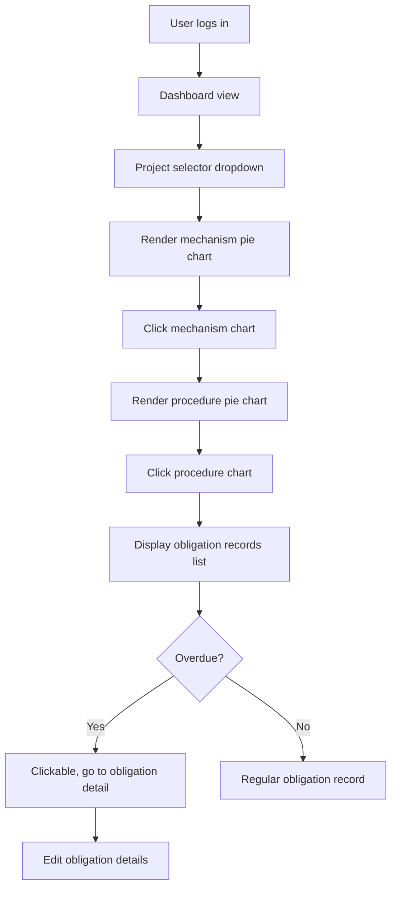
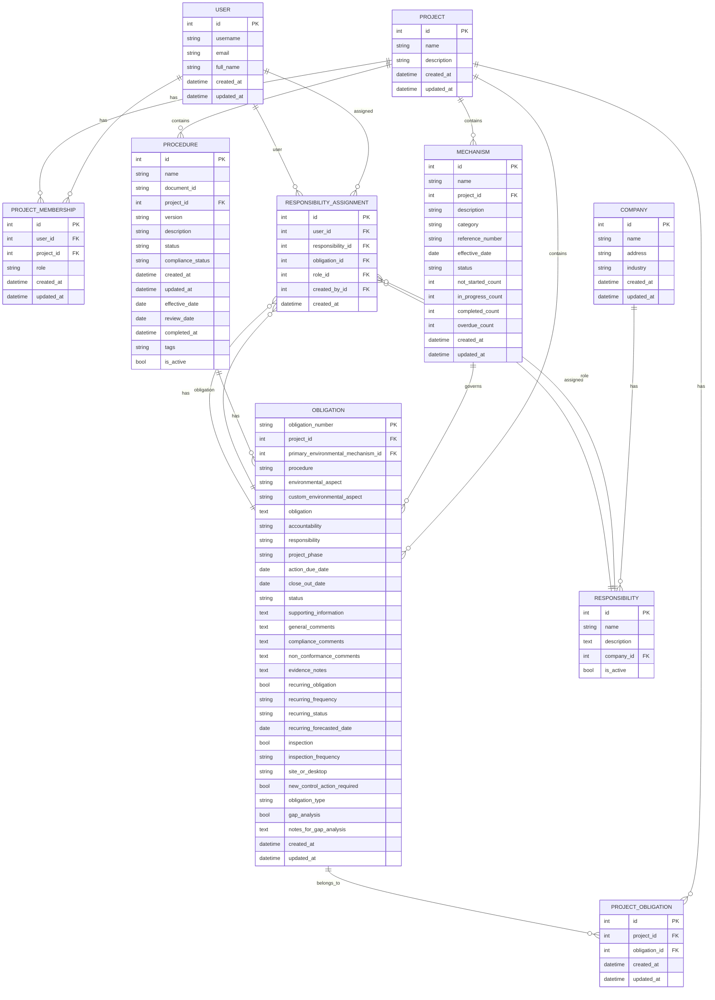

<!-- START doctoc generated TOC please keep comment here to allow auto update -->
<!-- DON'T EDIT THIS SECTION, INSTEAD RE-RUN doctoc TO UPDATE -->

- [Automated Issue #165: Obligation Details & Overdue Handling - CRUD, Chart Drilldown, Responsive Grid](#automated-issue-165-obligation-details--overdue-handling---crud-chart-drilldown-responsive-grid)
  - [Goal](#goal)
  - [Context](#context)
  - [Objectives](#objectives)
  - [Sources](#sources)
  - [Expectations](#expectations)
  - [Acceptance Criteria](#acceptance-criteria)
  - [Instructions](#instructions)
  - [Additional Guidelines](#additional-guidelines)
  - [Github Issue](#github-issue)
  - [Mermaid Flow Diagram](#mermaid-flow-diagram)
  - [ERD Diagram](#erd-diagram)
  - [Acceptance Criteria](#acceptance-criteria-1)
  - [Labels](#labels)
  - [Technical Context](#technical-context)

<!-- END doctoc generated TOC please keep comment here to allow auto update -->

---

description:
Automated prompt for resolving Issue #165: Implement comprehensive obligation drilldown from dashboard to project, mechanism, procedure, and obligation list/detail, with SVG pie charts (Matplotlib/Plotly), responsive grid, overdue handling, and full CRUD for obligations. Deliver by June 2 milestone with accessibility compliance and comprehensive testing.
mode: agent

tools:

- context7 # REQUIRED: Use for all context and background information, project standards, and configuration
- github # REQUIRED: Use to fetch issue #165 details, related PRs, and dashboard/obligation code
- filesystem # REQUIRED: Use to read and edit all relevant models, views, templates, and UI files
- git # REQUIRED: Use to inspect branches, diffs, and commit history
- sequential-thinking # REQUIRED: Use for stepwise reasoning, planning, and solution development
- fetch # Use for official documentation and standards as needed

---

# Automated Issue #165: Obligation Details & Overdue Handling - CRUD, Chart Drilldown, Responsive Grid

## Goal

Implement a comprehensive obligation drilldown workflow (user login → dashboard → project selector → mechanism pie chart → procedure pie chart → obligation list/detail) with SVG pie charts, responsive grid layout, overdue handling, and complete CRUD operations. Deliver by June 2 milestone with full accessibility compliance and comprehensive testing.

## Context

**Current State:**

- Obligation drilldown functionality is limited or entirely missing from the dashboard
- Charts may not be consistently rendered as SVG pie charts or lack interactivity
- Overdue obligations are not easily identifiable or accessible for editing
- CRUD operations on obligations are incomplete or provide poor user experience
- No responsive grid layout for charts across different display sizes
- Missing integration between dashboard, projects, mechanisms, procedures, and obligations

**Technical Requirements:**

- **Database Schema**: Complex relationships between USER, PROJECT, MECHANISM, PROCEDURE, OBLIGATION, and related entities with the following key models:
  - USER: Authentication and project membership management
  - PROJECT: Container for mechanisms, procedures, and obligations
  - MECHANISM: Environmental regulatory frameworks with status tracking
  - PROCEDURE: Specific processes with compliance status
  - OBLIGATION: Environmental requirements with due dates and recurring patterns
  - RESPONSIBILITY_ASSIGNMENT: User-to-obligation assignments with roles
- **Charting Technology**: Matplotlib for server-side SVG generation, Plotly Python SDK as middleware to bridge Matplotlib SVG logic and Plotly.js, and Plotly.js for client-side interactivity
- **Frontend Stack**: PicoCSS (classless), django-hyperscript, django-htmx, minimal TypeScript
- **Template Engine**: Django Template Language (DTL) with progressive enhancement
- **Responsive Design**: Grid layout adaptable to mobile, tablet, and desktop displays
- **Accessibility**: WCAG 2.1 AA compliance with screen reader support

**Feature Requirements:**

- **Complete Drilldown Flow**:
  1. User authentication and dashboard access
  2. Project selection via dropdown interface
  3. Mechanism pie chart display with click interaction
  4. Procedure pie chart display with click interaction
  5. Obligation list view with overdue highlighting
  6. Individual obligation detail pages with edit capabilities
  7. The user interface and navigation must strictly follow the workflow steps as detailed in the Mermaid flow diagram:
     - User logs in → dashboard → project selector dropdown → mechanism pie chart → procedure pie chart → obligation list (with overdue highlighting and clickable links) → obligation detail/edit view.
- **Chart Specifications**:
  - All charts must be pie charts rendered as SVG
  - Server-side generation using Matplotlib for static images
  - Plotly Python SDK must be used as a middleware to convert or link Matplotlib SVG output to Plotly.js compatible data/format
  - Client-side interactivity using Plotly.js for dynamic features
  - Responsive grid layout adapting to screen sizes
  - Color coding for status (not_started, in_progress, completed, overdue)
- **Obligation Management**:
  - Clear visual indication of overdue obligations (based on action_due_date)
  - Clickable overdue items linking to detail/edit views
  - Full CRUD operations (Create, Read, Update, Delete) accessible from both list and detail views
  - Form validation and error handling for all obligation fields
  - Support for recurring obligations with frequency tracking
  - Evidence notes and compliance comments management
- **User Experience**:
  - Intuitive navigation between drilldown levels
  - Accessible form controls and navigation
  - Progressive enhancement with fallback for non-JS users
  - Mobile-first responsive design
  - Loading states and error handling for AJAX interactions

## Objectives

- **Dashboard Enhancement**: Extend dashboard views to provide project selection and initial navigation entry point, strictly following the workflow in the Mermaid flow diagram.
- **Chart Implementation**: Create comprehensive charting system with:
  - Matplotlib-based SVG pie chart generation for mechanisms and procedures
  - Plotly Python SDK as middleware to bridge Matplotlib SVG logic and Plotly.js, enabling seamless data and format conversion
  - Plotly.js integration for client-side interactivity and tooltips
  - Responsive grid layout using CSS Grid and PicoCSS
  - Click handlers for chart segments to trigger drilldown navigation
- **Obligation Management System**: Implement complete CRUD functionality including:
  - ObligationListView with filtering, sorting, and pagination
  - ObligationDetailView with comprehensive field display
  - ObligationCreateView and ObligationUpdateView with form validation
  - ObligationDeleteView with confirmation and cascade handling
  - Overdue obligation highlighting and quick-edit capabilities
- **Navigation Flow**: Create seamless drilldown experience with:
  - Breadcrumb navigation showing current drilldown level
  - Back/forward navigation between chart levels
  - URL routing that maintains state and allows direct access
  - HTMX-powered dynamic content loading without full page refreshes
- **Responsive UI**: Ensure cross-device compatibility with:
  - Mobile-first CSS Grid layouts
  - Touch-friendly chart interactions
  - Accessible form controls and navigation
  - Progressive enhancement for enhanced features
- **Testing and Documentation**: Comprehensive coverage including:
  - Unit tests for all views, models, and forms
  - Integration tests for drilldown workflow
  - Accessibility testing with screen readers
  - Performance testing for chart rendering
  - Updated documentation for new features and APIs
- **Data Model Alignment**: All models and relationships must match the ERD diagram provided, ensuring the backend structure supports the workflow and UI requirements.

## Sources

- **Primary Codebase**:
  - `/workspaces/greenova/obligations/` - Main obligations app with models, views, forms, templates
  - `/workspaces/greenova/projects/` - Project management functionality
  - `/workspaces/greenova/dashboard/` - Dashboard views and templates
  - `/workspaces/greenova/static/` - CSS, JavaScript, and static assets
  - `/workspaces/greenova/templates/` - Base templates and components
- **Configuration Files**:
  - Project documentation and standards from context7
  - Django settings and URL configuration
  - Requirements and dependency management files
- **External Resources**:
  - Issue #165: <https://github.com/enveng-group/dev_greenova/issues/165>
  - Django 5.2 documentation: <https://docs.djangoproject.com/en/5.2/>
  - PicoCSS documentation: <https://picocss.com/docs/>
  - django-hyperscript documentation: <https://github.com/LucLor06/django-hyperscript>
  - django-htmx documentation: <https://django-htmx.readthedocs.io/>
  - Matplotlib documentation: <https://matplotlib.org/stable/>
  - Plotly.js documentation: <https://plotly.com/javascript/>

## Expectations

- **Comprehensive Implementation**: Use all available MCP servers to iteratively develop, refactor, and implement the complete obligation drilldown system including SVG pie charts, responsive grid layout, overdue handling, and full CRUD operations
- **Code Quality Standards**: Ensure all code follows project standards with:
  - Type annotations and beartype decorators
  - Google-style docstrings for all functions and classes
  - PEP 8 compliance with 88-character line limits
  - Comprehensive error handling and validation
- **Accessibility Compliance**: Implement WCAG 2.1 AA standards including:
  - Semantic HTML structure with proper headings
  - ARIA attributes for dynamic content
  - Keyboard navigation support
  - Screen reader compatibility
  - Color contrast compliance
- **Testing Requirements**: Create comprehensive test suite covering:
  - Model validation and business logic
  - View functionality and permission handling
  - Form validation and error cases
  - Chart rendering and interactivity
  - Responsive layout behavior
- **Documentation Updates**: Maintain current documentation including:
  - API documentation for new views and models
  - User guide for drilldown workflow
  - Technical documentation for chart implementation
  - Deployment and configuration notes
- **Performance Optimization**: Ensure efficient implementation with:
  - Database query optimization
  - Chart rendering performance
  - Responsive image handling
  - Minimal JavaScript bundle size

## Acceptance Criteria

- [ ] **Complete Drilldown Implementation**: Functional workflow from dashboard through project selection, mechanism pie chart, procedure pie chart, to obligation list/detail views, strictly following the steps in the Mermaid flow diagram.
- [ ] **SVG Pie Chart System**: All charts rendered as SVG using Matplotlib server-side with Plotly Python SDK as middleware to bridge Matplotlib SVG logic and Plotly.js, including click handlers and tooltips
- [ ] **Responsive Grid Layout**: Charts and content arranged in responsive grid that adapts to mobile, tablet, and desktop screen sizes
- [ ] **Overdue Obligation Handling**: Clear visual indication of overdue obligations with clickable links to detail/edit views, based on action_due_date comparison
- [ ] **Full CRUD Operations**: Complete Create, Read, Update, Delete functionality for obligations accessible from both list and detail views with form validation
- [ ] **Accessibility Compliance**: WCAG 2.1 AA standards met including semantic HTML, ARIA attributes, keyboard navigation, and screen reader support
- [ ] **Cross-Browser Compatibility**: Tested functionality across modern browsers with graceful degradation for older browsers
- [ ] **Performance Standards**: Fast chart rendering, efficient database queries, and responsive user interactions under typical load conditions
- [ ] **Comprehensive Testing**: Unit tests, integration tests, and accessibility tests with minimum 80% code coverage
- [ ] **Updated Documentation**: Current technical documentation, user guides, and API references reflecting all new functionality
- [ ] **Data Model Compliance**: All models and relationships must match the ERD diagram provided, ensuring backend and UI are fully aligned.

## Instructions

1. **Analysis Phase**: Use the github MCP server to fetch comprehensive details for issue #165, examine related dashboard, project, mechanism, procedure, and obligation code, and analyze current implementation gaps

2. **Code Exploration**: Use the filesystem MCP server to read and understand all relevant files including models, views, forms, templates, and existing UI components to establish baseline functionality

3. **Historical Context**: Use the git MCP server to inspect branches, diffs, and commit history to understand previous implementation attempts and avoid regression issues

4. **Strategic Planning**: Use the sequential-thinking MCP server to develop comprehensive implementation plan covering:

   - Database schema analysis and any required migrations
   - View hierarchy and URL routing design
   - Template structure and component organization
   - Chart implementation strategy with Matplotlib and Plotly.js
   - Testing strategy and coverage planning

5. **Standards Research**: Use context7 and fetch MCP servers to reference project coding standards, accessibility guidelines, and official documentation for all technologies involved

6. **Iterative Implementation**: Systematically implement changes following the drilldown workflow:

   - Dashboard project selector enhancement
   - Mechanism pie chart view and template
   - Procedure pie chart view and template
   - Obligation list view with overdue highlighting
   - Obligation detail/edit views with full CRUD
   - Responsive grid layout and accessibility features

7. **Quality Assurance**: Throughout implementation:

   - Run pre-commit checks after each significant change
   - Test functionality manually and with automated tests
   - Validate accessibility with screen reader testing
   - Verify responsive behavior across device sizes

8. **Documentation and Testing**: Create comprehensive documentation and test coverage for all new functionality

9. **Final Validation**: Run complete test suite, accessibility audit, and performance checks to ensure all acceptance criteria are met

10. **Iteration Until Complete**: Repeat and refine implementation until all acceptance criteria are fully satisfied and the feature is production-ready

## Additional Guidelines

- **Documentation Priority**: Use context7 and fetch MCP servers for official documentation lookup when implementing any external library integration or following project standards
- **Code Standards Compliance**: Strictly follow project coding, documentation, and UI standards as defined in the attached instructions
- **Accessibility First**: Design and implement with accessibility as a primary concern, not an afterthought
- **Maintainable Code**: Write code that is easily understood, modified, and extended by future developers
- **Incremental Delivery**: Structure implementation to allow for incremental testing and validation of each drilldown level
- **Error Handling**: Implement comprehensive error handling for all user interactions, database operations, and external dependencies
- **Security Considerations**: Ensure proper authentication, authorization, and input validation throughout the implementation
- **Performance Monitoring**: Include logging and monitoring capabilities to track system performance and user experience metrics

---

## Github Issue

````md
## Issue Type

Feature Request

---

## Title

feature: Obligation Details & Overdue Handling - CRUD, Chart Drilldown, Responsive Grid (June 2 milestone)

---

## Description

Implement detailed drilldown and CRUD for obligations, with modern charting and responsive UI, by June 2:

- Drill down from user logs → user dashboard → select project (dropdown) → mechanism pie chart → procedure pie chart → obligation list/detail view.
- All charts are rendered as SVG pie charts (Matplotlib on server, Plotly for interactivity on client).
- Charts display in responsive grid view, adjusting to different display sizes.
- Each overdue obligation is clickable and links to its detail page.
- Edit individual obligation records from their detail pages.
- Perform full CRUD (Create, Read, Update, Delete) operations on obligations.

---

## Current Behavior

- Obligation drilldown is limited or missing.
- Charts may not be interactive, responsive, or consistently rendered as SVG pie charts.
- Overdue obligations may not be easily accessible or editable from detail pages.
- CRUD operations on obligations may not be complete or user-friendly.

---

## Expected Behavior

- Authenticated users can select a project, view mechanism and procedure pie charts, and drill down to obligations.
- All charts are pie charts, SVG rendered by Matplotlib; client-side interactivity via Plotly.js.
- Charts are arranged in a responsive grid view, rendering well on all display sizes.
- Obligation list displays records with overdue obligations clearly marked and clickable for detail/edit.
- Full CRUD on obligation records, accessible from list and detail views.

---

## Pseudocode

```pseudocode
FUNCTION dashboardDrilldown()
    IF user is authenticated THEN
        DISPLAY project selector dropdown
        ON project select:
            RENDER mechanism pie chart (SVG)
            ON mechanism chart click:
                RENDER procedure pie chart (SVG)
                ON procedure chart click:
                    DISPLAY obligation records list (mark overdue)
                    FOR each record:
                        IF overdue THEN
                            MAKE clickable to obligation detail page
                    END FOR
    END IF
END FUNCTION

FUNCTION editObligationDetail()
    ON obligation detail page:
        DISPLAY obligation details
        ALLOW edit/save/delete
END FUNCTION
```
````

---

## Mermaid Flow Diagram



---

## ERD Diagram



---

## Acceptance Criteria

- [ ] Drilldown from dashboard through project > mechanism > procedure > obligation list is implemented.
- [ ] All charts are SVG pie charts, rendered with Matplotlib; client-side interactivity via Plotly.js.
- [ ] Responsive grid layout for charts.
- [ ] Overdue obligations are clearly clickable and link to detail/edit views.
- [ ] Full CRUD for obligations from both list and detail views.
- [ ] Accessibility (WCAG 2.1 AA) and minimal UI best practices followed.
- [ ] Documentation and tests updated.

---

## Labels

- enhancement
- django
- ui
- obligations
- charts
- plotly
- matplotlib

---

## Technical Context

- **Django Version**: 5.2
- **Python Version**: 3.12.9
- **Frontend Technologies**: PicoCSS, django-hyperscript, django-htmx, Plotly.js
- **Charting**: Matplotlib (SVG server-side), Plotly.js (client interactivity)
- **Database**: SQLite3 (development)
- **Affected Module/App**: obligations, projects, dashboard
- **Template Engine**: Django Template Language (DTL)

```

```
