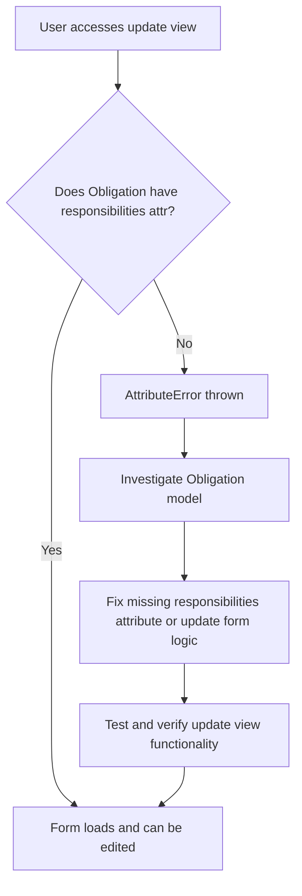

# GitHub Issue Creation Template for Greenova

This template provides standardized commands for creating GitHub issues from
bug reports using the GitHub CLI.

## Basic Issue Creation Command

````fish
# Basic structure of the gh issue create command
set repo "https://github.com/enveng-group/dev_greenova"
set title "bug: Obligation update view fails with AttributeError"
set body "
## Description

The obligation update view (`/obligations/update/<obligation_id>/`) throws an `AttributeError: 'Obligation' object has no attribute 'responsibilities'` when accessed via GET request. This prevents users from editing existing obligations.

## Current Behavior

When a user tries to edit an obligation, the following error occurs:

```
Traceback (most recent call last):
  File "/home/ubuntu/greenova-0.0.5/.venv/lib/python3.9/site-packages/django/core/handlers/exception.py", line 56, in inner
    response = get_response(request)
  # ... (traceback continues) ...
  File "/home/ubuntu/greenova-0.0.5/greenova/obligations/forms.py", line 403, in __init__
    self.fields['responsibilities'].initial = instance.responsibilities.all()

Exception Type: AttributeError at /obligations/update/PCEMP-51/
Exception Value: 'Obligation' object has no attribute 'responsibilities'
```

## Expected Behavior

- The obligation update form should load without error
- Users should be able to edit and update obligations as expected

## Technical Context

- **Django Version**: 4.1.13
- **Python Version**: 3.9.21
- **Frontend Technologies**: PicoCSS, django-hyperscript, django-htmx
- **Database**: SQLite3 (development)
- **Affected Module/App**: obligations
- **Affected Files (Estimate):**
  - /workspaces/greenova/greenova/obligations/views.py
  - /workspaces/greenova/greenova/obligations/forms.py
  - /workspaces/greenova/greenova/obligations/models.py
  - /workspaces/greenova/greenova/obligations/templates/obligations/obligation_form.html (or similar update template)
- **Template Engine**: Django Template Language

## Impact Assessment

- **Severity**: Critical
- **User Impact**: Users cannot edit obligations
- **Frequency**: Every attempt to edit an obligation

## Visual Evidence

_Include screenshots or videos if available._

## Mermaid Diagram



## Proposed Implementation

1. Review the Obligation model and ensure the `responsibilities` attribute exists or update the form logic to use the correct attribute (e.g., `responsibility` if it is a CharField or ForeignKey).
2. Update the form initialization in `obligations/forms.py` to avoid referencing a non-existent attribute.
3. Add/adjust tests to cover the update view and form initialization.
4. Ensure the update template renders without error.

## Acceptance Criteria

- [ ] Obligation update form loads without error
- [ ] Users can edit and update obligations
- [ ] All related tests pass
- [ ] Code is properly documented

## Labels

- bug
- django
- obligations
- forms
- priority-critical
"

# Execute the command to create the issue
gh issue create --repo $repo --title $title --body $body --label "bug,django,obligations,forms,priority-critical"
````

---

## Updating Issue with Project Fields

After creating an issue, you can link it to the Greenova project and set
project fields using the GitHub CLI. Replace `<issue-number>` with your issue
number.

```fish
# Set variables
set project_id "8"  # Greenova project ID
set issue_number <issue-number>
set issue_node_id (gh issue view $issue_number --json id --jq ".id")

# Add issue to project
# (You may need to authenticate and have project write access)
gh project item-add $project_id --content-id $issue_node_id

# Set project fields for the issue
# Status options: Sort, Set In Order, Shine, Standardize, Sustain, Safety, Spirit
# Priority options: P1, P2, P3, P4
# Size options: XS, S, M, L, XL
# Effort: 3

gh project item-edit $project_id --id $issue_node_id \
  --field "Status" --value "Sort" \
  --field "Priority" --value "P1" \
  --field "Size" --value "M" \
  --field "Effort" --value "3"

# Set other fields as needed (see below for field IDs and names)
# Example: Set Assignees, Labels, Milestone, etc.
#
# gh project item-edit $project_id --id $issue_node_id --field "Assignees" --value "username"
# gh project item-edit $project_id --id $issue_node_id --field "Labels" --value "bug,django,obligations,forms,priority-critical"
# gh project item-edit $project_id --id $issue_node_id --field "Milestone" --value "Q3-2024"

# Project Fields Reference:
# | Field Name   | Field ID                          | Type                        | Options (if applicable)         |
# |--------------|-----------------------------------|-----------------------------|---------------------------------|
# | Title        | PVTF_lAHOCchfJ84A3c00zgslf0M      | ProjectV2Field              |                                 |
# | Assignees    | PVTF_lAHOCchfJ84A3c00zgslf0Q      | ProjectV2Field              |                                 |
# | Status       | PVTSSF_lAHOCchfJ84A3c00zgslf0U    | ProjectV2SingleSelectField  | Sort, Set In Order, Shine, Standardize, Sustain, Safety, Spirit |
# | Labels       | PVTF_lAHOCchfJ84A3c00zgslf0Y      | ProjectV2Field              |                                 |
# | Milestone    | PVTF_lAHOCchfJ84A3c00zgslf0g      | ProjectV2Field              |                                 |
# | Priority     | PVTSSF_lAHOCchfJ84A3c00zgslf9E    | ProjectV2SingleSelectField  | P1, P2, P3, P4                  |
# | Size         | PVTSSF_lAHOCchfJ84A3c00zgslf9I    | ProjectV2SingleSelectField  | XS, S, M, L, XL                 |
# | Effort       | PVTF_lAHOCchfJ84A3c00zgslf9M      | ProjectV2Field              | Number (1-8)                    |
# | ...          | ...                               | ...                         | ...                             |

```
